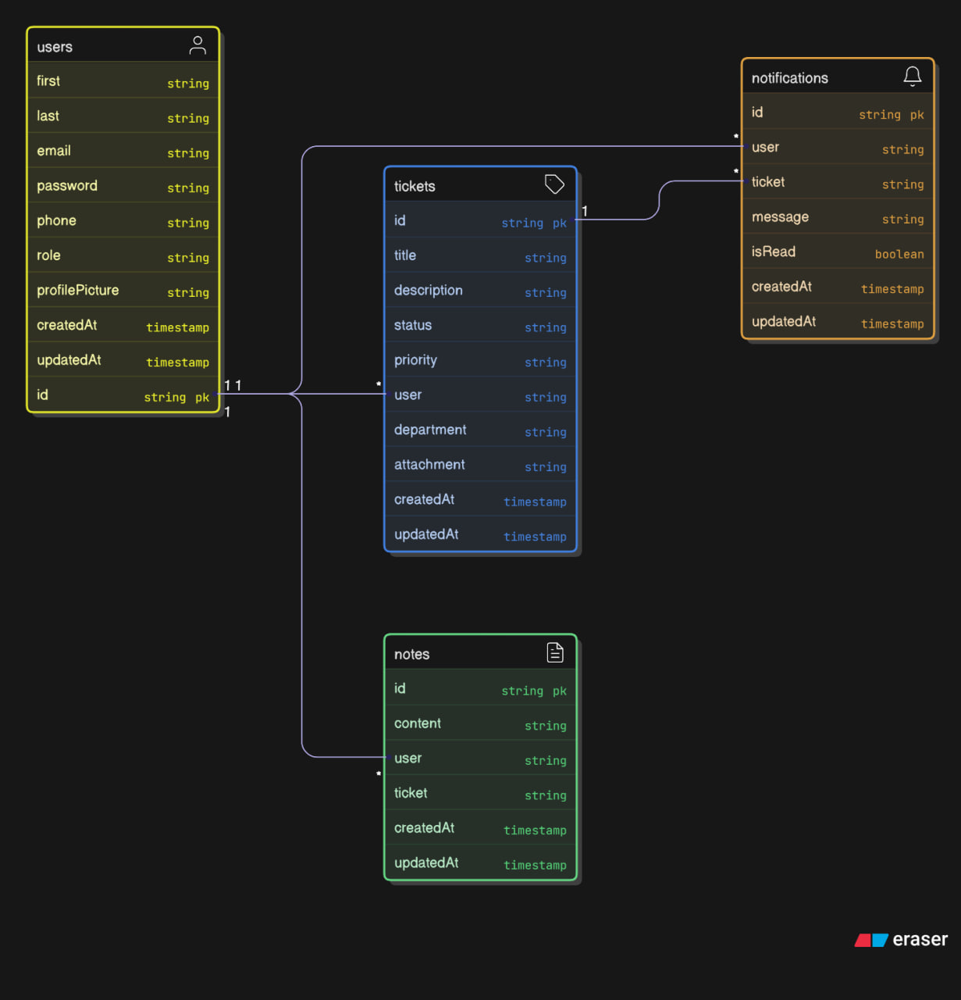
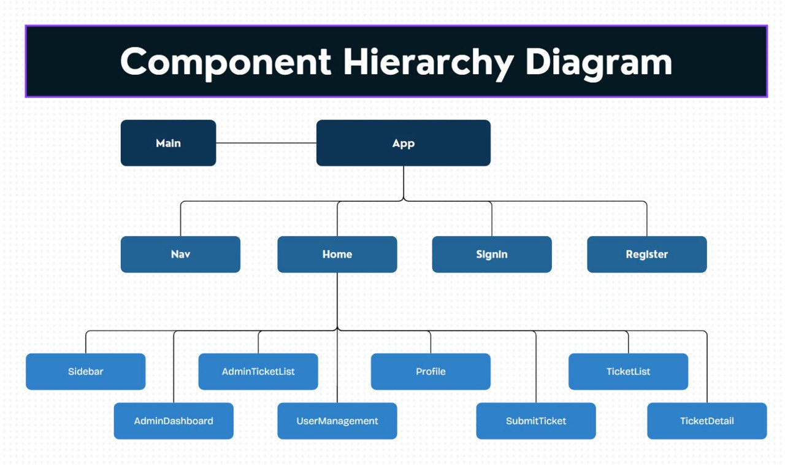
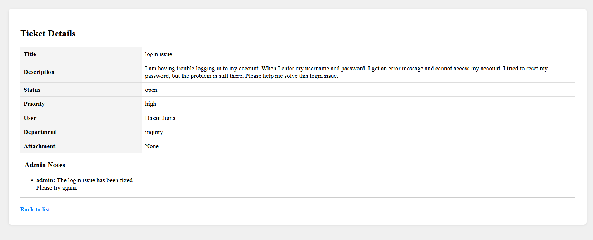
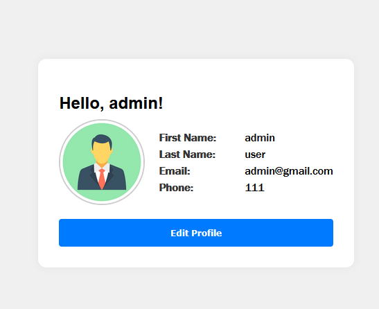
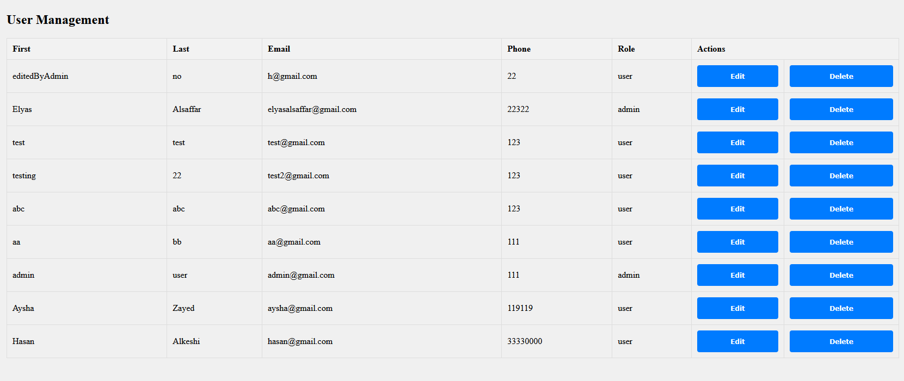

# ticketly-backend

---

## 🎫 Ticket Management System (MERN Stack)

A full-stack web application built with the MERN stack (MongoDB, Express.js, React, Node.js) that allows users to create and manage support tickets, and provides an admin dashboard for support staff to respond and monitor tickets.

---

## 🌐 Live Deployment

You can access the live application here: [Ticketly Frontend](https://ticketly-frontend.surge.sh/)

---

## 📸 Screenshots

---

### 🗺️ ERD

### 🗂️ Component Hierarchy Diagram

### 🖥️ Home Page

### 🧾 Submit Ticket

### 📂 My Tickets View

### 📋 Admin Dashboard

### 📝 Ticket Details

### 👤 Profile User

### 👥 User Management

---

## 📦 Features

---

### 👤 User Features:
- 📝 Register and log in securely (JWT Authentication)
- 📨 Submit support tickets with title, description, category .
- 📋 View submitted tickets and their statuses .

### 🛠️ Admin Features:
- 🔐 Secure login to access admin dashboard
- 🗃️ View, delete, and update user roles
- 🕵️ View all tickets with full details . 
- 💬 Reply to tickets using internal notes
- 🔄 Change ticket status (e.g., Open, Closed)
- 📊 View system statistics (total tickets, open/closed , total users)

---

## 📌 Technologies Used

---

### 🖥️ Frontend:
- React.js 
- React Router DOM 
- Context API 
- Axios 
- CSS 

### 🔧 Backend:
- Node.js 
- Express.js 
- MongoDB 
- Mongoose 
- JWT Authentication 
- Bcrypt.js 
- dotenv 

---

## 📚 User Stories

---

### 👥 User Stories (User)

1. 👤 As a user, I want to register and log in so that I can submit and track my support tickets.  
2. 📨 As a user, I want to submit a support ticket with a title, description, category to request help.
3. 📋 As a user, I want to view all my submitted tickets and their statuses so I can follow up on my requests.  
4. 📧 As a user, I want to receive email notifications when my ticket gets a reply or its status changes so I stay informed.  
5. 🔁 As a user, I want to see the number of replies (notes) on each ticket to understand the level of activity.

---

### 🛠 User Stories (Admin / Support)

1. 🔐 As an admin, I want to log in securely to access the admin dashboard.  
2. 🗃️ As an admin, I want to view, delete, and update user roles to manage the system effectively.  
3. 🕵️ As an admin, I want to view all tickets with details to monitor and manage user requests.  
4. 💬 As an admin, I want to reply to tickets using notes to assist users with their issues.  
5. 🔄 As an admin, I want to change the status of tickets (e.g., open, closed) to indicate progress.  
6. 📈 As an admin, I want to see the number of replies (notes) per ticket for better tracking and prioritization.  
7. 📊 As an admin, I want to view system statistics (total tickets, total users, open vs. closed tickets) to assess support performance.

---

### 🗂️ Trello Board  
Track our project's progress and tasks on Trello:  
🔗 [View Trello Board](https://trello.com/b/dMRBIo3x/it-ticketing-system-project)

---

### 🚀 Future Improvements

- Enhance the admin user interface .
- Send email notifications when a ticket is created or a reply is added .
- Allow users to interact and add replies .

---

### 👥 Team Members

- Elyas Alsafar .
- Aysha Zayed . 
- Hasan Juma .
